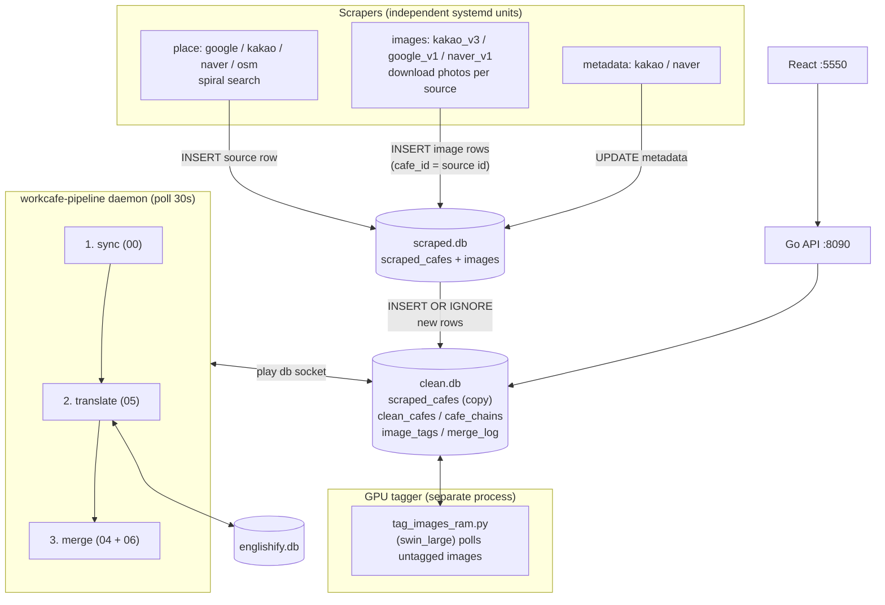
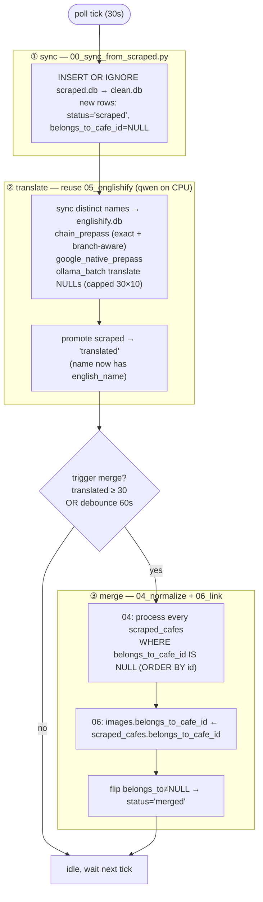
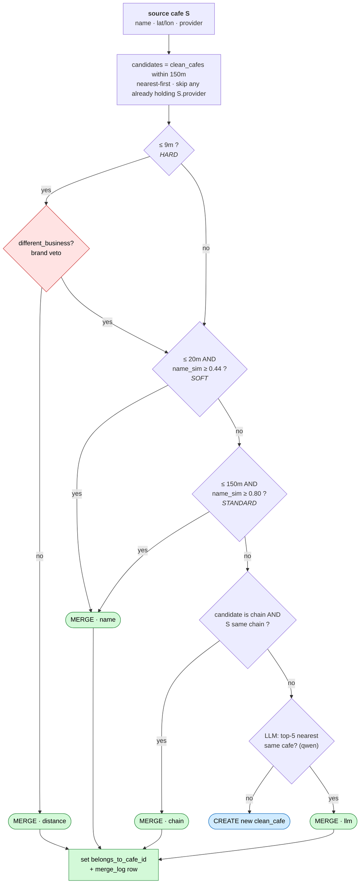
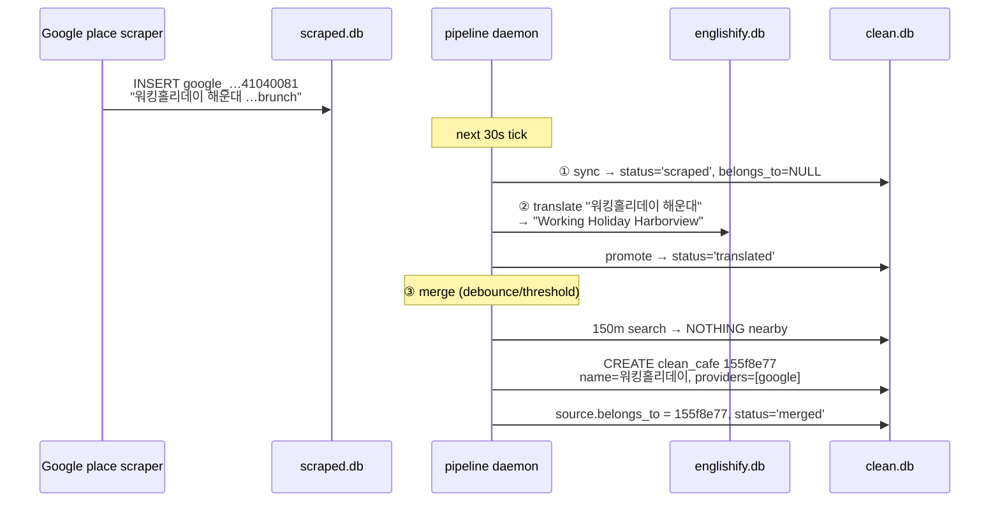
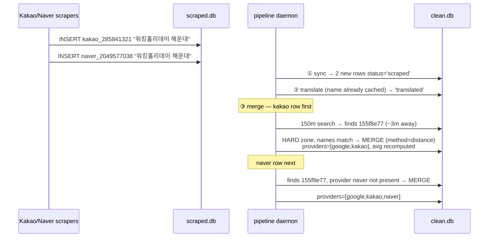
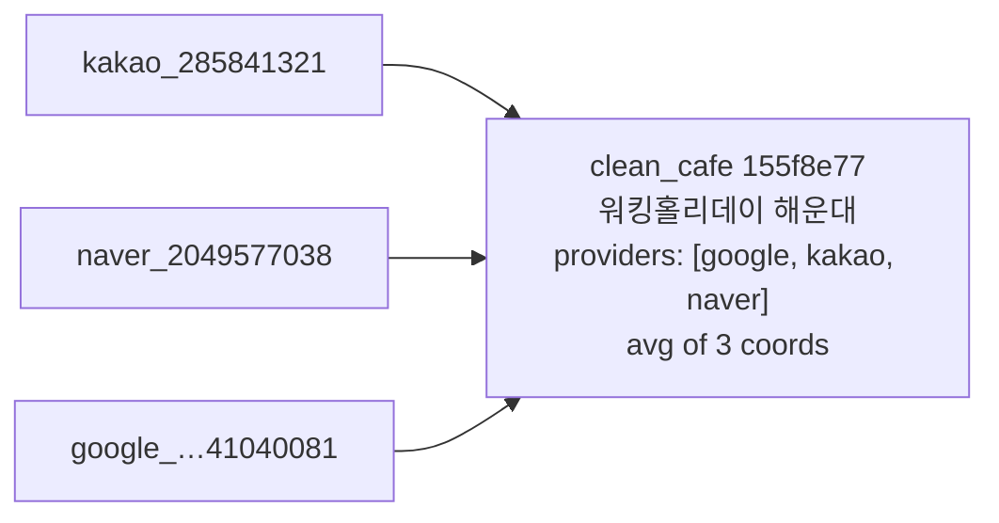
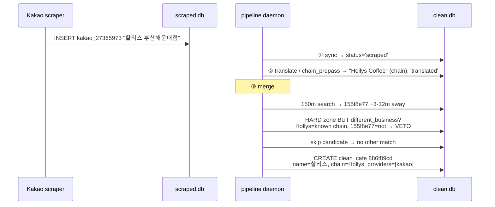
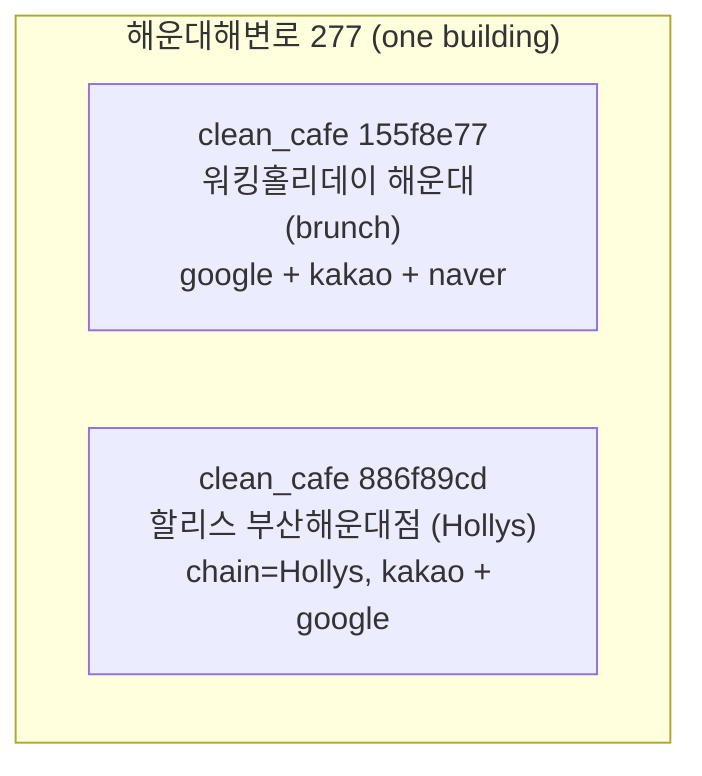
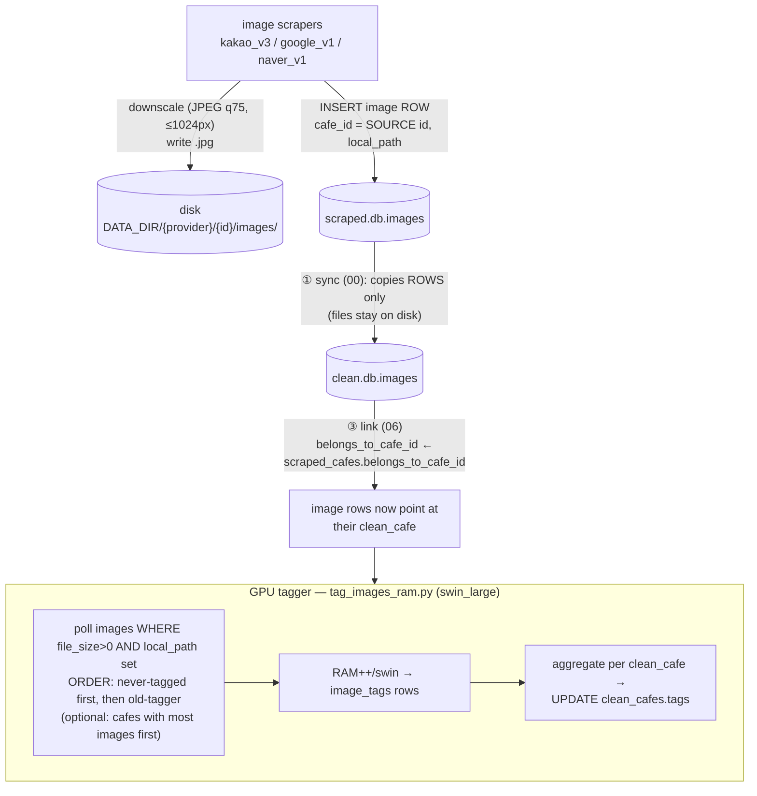
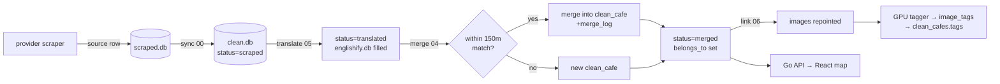

# Scrape → Merge → Clean: real-time ingest mechanism

_2026-06-26 — how a freshly-scraped cafe flows from a provider into `clean.db`, gets deduped/merged, translated, and surfaced with images + tags._

This documents the **live** path (the `workcafe-pipeline` daemon), not the manual batch recipes. Manual recipes (`just merge-pipeline`, `just detect-chains`) run the same step scripts; the daemon just calls them on a loop.

---

## 0. The three databases

| DB | owner | holds | who writes |
|----|-------|-------|-----------|
| `scraped.db` | db_server (`/tmp/workcafe_db.sock`) | raw `scraped_cafes` + `images`, one row per **provider source** | place scrapers + image scrapers |
| `clean.db` | play db_server (`/tmp/workcafe_play_db.sock`) | a **copy** of scraped data + the deduped `clean_cafes`, `cafe_chains`, `image_tags`, `merge_log` | pipeline daemon + tagger |
| `englishify.db` | direct sqlite | `name_translations` cache: Korean name → English (persistent) | translate step |

Key idea: **`scraped.db` is the raw landing zone**; `clean.db` is the deduped product. A source row's primary key is `{provider}_{provider_id}` (e.g. `kakao_285841321`). One real-world cafe usually has **several** source rows (one per provider) that the merge collapses into **one** `clean_cafes` row.

---

## 1. System overview

The daemon, the tagger, the scrapers, and the API are **all separate processes**. They never call each other directly — they coordinate purely through DB row state (`status`, `belongs_to_cafe_id`, `tagged_at`). No queue table.

---

## 2. The daemon cycle (what runs in what order)

Every 30s the daemon runs three steps in a fixed order: **sync → translate → merge**. Translate runs *before* merge ("Order B") so a cafe already has an English name cached when it lands in `clean_cafes`.

**Status flow of a source row:** `scraped → translated → merged`. The status column lives in `clean.db.scraped_cafes` — it *is* the queue (no separate queue table).

Config (`data/pipeline.json`): `poll_interval_s=30`, `merge_debounce_s=60`, `translate_batch=30`, `chain_promote_min=5`, `image_priority_first_n=30`, `llm_on_cpu=true` (GPU reserved for the tagger).

---

## 3. What the merge actually looks at (step ③ internals)

For each unmerged source row, `04_normalize.process_cafe` searches existing `clean_cafes` **within 150 m** (bbox query) and decides: merge into one, or create a new clean cafe. Candidates already containing the **same provider** are skipped (a clean cafe holds at most one source per provider).

Read it as a **priority ladder**: evaluate candidates nearest-first; the first rule that fires wins. A `different_business` veto disqualifies the cheap 9 m distance-merge, so evaluation falls through to the name/chain/LLM rules — which a true different-business pair (low `name_sim`, no shared chain) fails, landing on **CREATE new**.

- **`name_sim`** = best of three: raw Levenshtein+cosine, branch-stripped (`스타벅스 명동점` → `스타벅스`), and English-vs-English (via englishify cache).
- **`different_business`** (the 2026-06-26 fix): inside the 9 m hard zone, veto the blind distance-merge when brand identities clearly differ (one is a known chain and the other isn't, or two different chains). Stops co-located businesses in one building from swapping records.
- **On MERGE** → `merge_into_clean_cafe`: append `source_id`, add provider, recompute `avg_lat/avg_lon` as a running mean, backfill address/url/metadata if empty, write a `merge_log` row (`ts, method, detail`).
- **On CREATE** → new `clean_cafes` row, id = `uuid5(source_id)` (deterministic/stable). Chain assigned via known-list or on-the-fly promotion (a brand token seen ≥5 times becomes a chain). English name from the chain (authoritative) or the englishify cache.
- Either way → `scraped_cafes.belongs_to_cafe_id = clean_id`. Finally `propagate_english_names` refreshes `clean_cafes.english_name` (chain canonical name wins over a per-name translation).

---

## 4. Concrete walk-through

Building at `해운대해변로 277`. Two real businesses stacked in it: **Hollys Coffee** (`할리스`) and a brunch cafe **Working Holiday** (`워킹홀리데이`). Watch them flow in.

### Stage A — first source ever (Google finds Working Holiday)

Result: one clean cafe, one provider.

### Stage B — second source, SAME cafe (Kakao + Naver find Working Holiday)

Result: still **one** clean cafe, now three sources collapsed into it.

### Stage C — different business, SAME building (Hollys arrives <9 m away)

This is where the `different_business` veto earns its keep. Without it, the Hollys source would blind-merge into the Working Holiday cluster by raw distance.

Result: **two** clean cafes at the same coordinates — correct, they are two businesses.

> Before the fix, the 9 m blind merge attached each building-mate's Google record to the *wrong* sibling (a swap). The veto prevents new swaps; `scripts/fix_swapped_sources.py` repaired the rows already committed.

---

## 5. Images → tags (how labeling gets fed)

There is **no explicit labeling queue**. Image scrapers download + downscale photos to disk and insert an image **row** into `scraped.db`; sync copies that **row** (not the file) into `clean.db`; `06` links it to the clean cafe; the GPU tagger polls for anything untagged.

Two distinct things move — keep them apart:

- **Bytes (the `.jpg` file) → disk, once.** The scraper saves to `DATA_DIR/{provider}/{safe_id}/images/photo_NNNN.jpg` via `save_image()`, which **downscales at scrape time**: re-encode JPEG **quality 75**, resize longest side to **≤1024 px** (LANCZOS, only if larger). The DB stores `local_path` as a **web path** (`/images/kakao/…`), not the file's bytes. Files are written once and never copied again.
- **Row (the image record) → DBs.** `cafe_id` = the **source** id (e.g. `kakao_285841321`), plus `local_path`, dimensions, exif. The row is what `00` copies `scraped.db.images → clean.db.images` (INSERT OR IGNORE); both DBs' rows reference the same on-disk file.

Notes:
- An image's `belongs_to_cafe_id` is **inherited from its source's** `belongs_to_cafe_id`. So when the merge (or the swap-fix) moves a source between clean cafes, `06` re-points that source's images on the next cycle — tags follow the source automatically.
- Image-scrape **order** is steered per provider: kakao serves `priority DESC` first (set by `mark_region_image_priority.py` for a region) and caps ~`image_priority_first_n=30` photos/cafe breadth-first; naver is `RANDOM()`. This front-loads ~30 photos/cafe across a region before deep backlog.
- The tagger runs on `clean.db` as its own process (`just image-pipeline`), on the GPU, while the pipeline LLM stays on CPU — so tagging and merging never contend for the GPU.

---

## 6. One-glance summary

**Order, for one Google-first cafe:** scrape→`scraped.db` ➜ sync→`clean.db (scraped)` ➜ **englishify** (translate, before merge) ➜ **merge** (radius + name + chain + brand-veto, else new) ➜ link images ➜ status `merged` ➜ tagger labels images → rolls tags onto the clean cafe ➜ API serves it.
