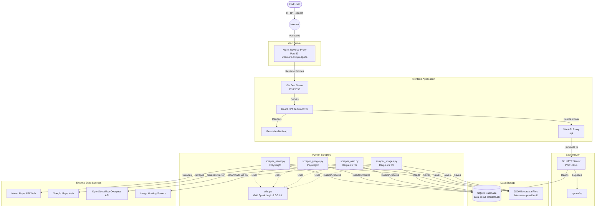

# Work Cafe Map Architecture

This document outlines the current architecture of the Work Cafe Map project based on the files in the repository. The project is designed to scrape cafe data from multiple providers, unify the data, and present it on an interactive map.

## High-Level Architecture

The system consists of three main phases: **Data Collection (Scraping)**, **Data Storage & Processing**, and the **Web Application (Frontend & API)**.

## Component Details

### 1. External Data Sources
The system relies on pulling mapping data from external providers (currently **Naver Maps**, **Google Maps**, and **OpenStreetMap**).

### 2. Scraper System (`scraper/`)
The scraping layer is built in Python and is responsible for systematically gathering data across a city using a spiral grid search algorithm, and retrieving associated images.
- **Tor Proxy**: Used to route requests and avoid IP bans (429 Too Many Requests) by frequently changing the exit node (used by OSM scraper, Google scraper, and Image scraper).
- **Playwright**: Used for providers like Naver Maps and Google Maps that rely heavily on JavaScript and complex API requests. It intercepts network traffic to extract JSON/JSONP responses directly or parses complex DOMs.
- **Spiral Algorithm (`utils.py`)**: Generates coordinates spiraling outward from a central point to ensure comprehensive geographic coverage.
- **Image Scraper (`scraper_images.py`)**: A dedicated scraper that reads cafe metadata from the database and downloads associated images locally.

### 3. Data Storage Layer (`data/`)
Data is saved in a dual-format to ensure durability and ease of processing:
- **SQLite Database (`cafedata.db`)**: 
  - `cafes` table: Stores normalized, high-level metadata (ID, provider, name, coordinates, address, URL).
  - `progress` table: Tracks which grid coordinates have been successfully scraped per provider, allowing scrapers to resume if interrupted.
- **JSON Files**: The raw, unadulterated JSON payload from each provider is saved to the filesystem (`data/[city]/[provider]/[id]/cafe.json`). This allows for future re-processing without needing to re-scrape.

### 4. Backend API (`api/`)
- **Go API**: A lightweight Go server (`main.go`) that connects to the SQLite database and exposes the `/api/cafes` endpoint on port `13854`. Serves the unified cafe data to the frontend.

### 5. Frontend Application (`frontend/`)
- **React SPA**: A statically hosted application utilizing Vite, TailwindCSS, and React-Leaflet to visualize the cafes on an interactive map. Vite proxies `/api` calls to the Go backend while serving on port `5550`.

### 6. Web Server
- **Nginx**: `setup_nginx.sh` sets up an Nginx reverse proxy that takes internet traffic on port `80` (domain `workcafe.c.tmpx.space`) and forwards it to the Vite dev server.
