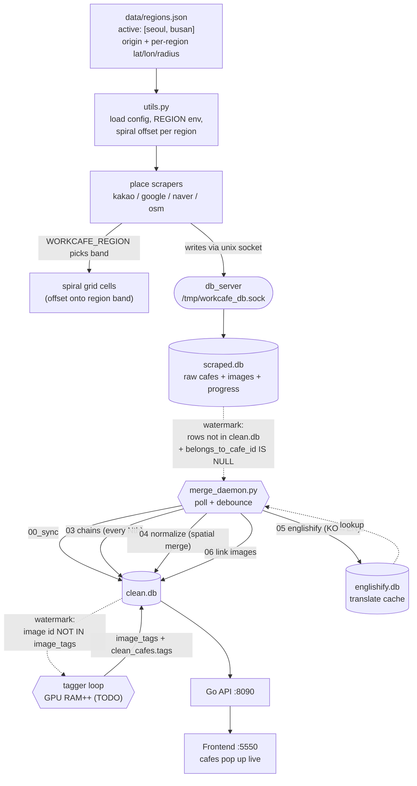

# Busan Scraper + Streaming Pipeline — Refinement Log

> Ultra caveman log. Append as work go. Newest decisions bottom.
> Numbered checkpoints: `busan-scraper-refinements-00.md` (region+sample), `-01.md` (safety+cleaner+push), `-02.md` (UI funnel).

## STATUS @ 2026-06-23 01:34 — DENSE SUMMARY (iter 2)
- **Busan now: 248 clean_cafes, 18 with photos (1,239 imgs).** Map dense, browser-verified. Iteration 2 (places 25 cells → merge → 12 img cafes → link) ran in background ~24 min. Checkpoint -05.
- Full loop proven + repeatable: scrape-one busan → merge chain → scrape-region-images busan → clean_region wipe (Seoul safe).

## STATUS @ 2026-06-23 00:47 — DENSE SUMMARY
- **SUCCESS (latest, user):** busan cafes have sample PICS on UI. **MET** ✓ — 6 cafes / 590 photos scraped+linked; browser-verified 고니스커피 detail pane shows 5 real photos (`tmp/busan_PICS.png`). Browser test now works (sandbox-off + started vite :5550).
- **Prior DONE:** cafes pop up on map w/ correct data. **MET** ✓ — 90 busan clean_cafes, translated, `/api/clean_cafes` returns all 90.
- **Images = separate scraper.** `kakao-images` (state table, random queue) was inactive → 0 busan imgs. Focused tool added: `just scrape-region-images busan N`. Link needs `06_link` (merge_daemon does it).
- Checkpoints: -00 region+sample, -01 safety+push, -02 funnel, -03 merge-live, -04 images+browser.
- **Region:** busan added, grid offset (+204,-239), config `data/regions.json`, Seoul untouched. ✓ live-verified.
- **Scrape:** sample = 90 busan cafes, coords dead-on, names good. Resumable via progress table. ✓
- **Merge fix:** kakao-first KILLED → all providers spatial-merge densest-first (streaming-safe). ✓ compiles.
- **Streaming:** `merge_daemon.py` poll+debounce. NOT enabled yet (run manual first).
- **Safety:** backups `pre-busan-2026-06-22` (integrity ok). `clean_region.py` busan-only wipe, Seoul refused. ✓ proven.
- **UI funnel:** `/api/status` + SettingsModal → raw→queue→merged ‖ imgTotal→dl→processed. API LIVE-VERIFIED (42047→258→29230 ; 2.64M→2.51M→2.34M, invariant ok). Frontend tsc-ok, not browser-checked (vite down here).
- **Pushed:** commit e96d547 (region+merge+cleaner). UI funnel commit pending.
- **Open:** run merge → verify busan on map API → confirm frontend refresh shows them. ollama needed for englishify (check).

## GOAL
- Add Busan scrape region. Keep Seoul untouched (prod, expensive to remake).
- Streaming: scraper drop cafe → merge daemon grab it → translate → link images → tagger tag → frontend pop up live.
- Iterate small: scrape little Busan → eyeball data → fix algo → wipe Busan → scrape again.
- Busan area = EXPENDABLE (user test data). Seoul = SACRED.

## BIG IDEA (how grids not collide)
- One global grid origin = Seoul City Hall. Every cell = integer (x,y) offset from origin.
- Busan center ~204 east / -239 south of origin → own disjoint grid band.
- So `progress(grid_x,grid_y,provider)` keys never clash. One shared `scraped.db`. Zero scraper edits for coords.

## SYSTEM WIRING



- **No message bus.** Stages chain by DB columns (watermarks). Crash mid-way = watermark stays = restart re-picks. Self-heal.
- Scraper write ONLY through `db_server` socket (serialized). Merge + tagger use separate **play** socket on `clean.db`.

## TOOLS BUILT

| File | What | How invoke |
|---|---|---|
| `data/regions.json` | region config: active list, origin, per-region center+radius | edit by hand / `just region-*` (TODO) |
| `scraper/lib/utils.py` | loads regions.json; `REGION` env; `region_grid_offset()`; spiral shifted to region band | imported by all scrapers |
| `data-processing/04_normalize_pipeline.py` | **kakao-first assumption KILLED** — all providers spatial-merge, densest-first | `just normalize` |
| `data-processing/merge_daemon.py` | poll watermark, debounce, run incremental merge chain | `just start merge` (unit TODO) |
| `data-processing/clean_region.py` | delete ONE region (bbox), Seoul refused, dry-run default | see usage |
| `data/seoul/backups/pre-busan-2026-06-22/` | full online DB backup before Busan | restore: see README there |

## KAKAO-FIRST FIX (why)
- OLD: pass1 kakao = insert-only anchors, pass2 others merge into kakao.
- BREAK: streaming/Busan, google cafe arrive before kakao → google make anchor → kakao (insert-only) make DUP.
- NEW: every provider does spatial merge. Same-provider guard stops self-collapse. Process densest provider first (computed per run) so anchors form first. Kakao no longer special.

## SAMPLE USAGE

```bash
# --- backup before risky stuff ---
just backup-dbs pre-busan          # (recipe TODO; manual done 2026-06-22)

# --- scrape small Busan sample (one provider, few cells) ---
just scrape-one kakao 9 busan      # 9 spiral cells around Busan center
WORKCAFE_REGION=busan just scrape-one google 9 busan

# --- inspect Busan rows only ---
python data-processing/clean_region.py --region busan          # dry-run = count per table

# --- merge once (manual), then eyeball frontend ---
just merge-pipeline                # full; or merge_daemon for streaming

# --- wipe Busan, keep Seoul, re-sample ---
python data-processing/clean_region.py --region busan --confirm

# --- streaming end-state (TODO units) ---
just start play-db                 # persistent clean.db socket
just start merge                   # merge_daemon polls + merges
just start tagger                  # tagger loop tags new images
```

## RESUMABILITY
- `progress(grid_x,grid_y,provider,status='completed')` = scraper skip done cells → resume free.
- merge watermark = `belongs_to_cafe_id IS NULL` → merge resume free.
- tagger watermark = image not in `image_tags` → tag resume free.

## DECISION LOG (2026-06-22, ~23:5x KST)
- Grid offset trick chosen over per-region DB → no second db_server, one scraped.db. ✓ verified seoul offset (0,0), busan (204,-239).
- regions.json + fallback defaults so scraper never crash if file missing. ✓ verified.
- Merge daemon = polling + debounce (threshold 200 cafes OR 600s wait). Reuse existing scripts via subprocess, no logic dup.
- Backups via online `sqlite3 .backup` (scrapers live, no stop needed). ✓ integrity ok, counts match.
- Found stray Busan cafe "sobo" (google, 2026-04-15) → user say expendable test data. OK to wipe.
- All Seoul scrapers running now; default to seoul (no env), nothing iterates active list yet → cannot drift to Busan by accident.

## SAMPLE 1 RESULTS (2026-06-23 ~00:0x)
- Fired `just scrape-one kakao 9 busan`. Timeout 300s cut it at 7/9 cells (NOT stuck — just slow via Tor). → **90 cafes**.
- Coords tight on target: lat[35.085,35.117] lon[129.018,129.045]. Grid offset CORRECT on live data. ✓
- No dup names in sample. Real Busan cafes (아인스크레페, 모모스 영도 로스터리, 젬스톤 영도점...).
- **FINDING (refine candidate):** name has raw HTML entity `&amp;` → "모모스 영도 로스터리&amp;커피바". Scraper not unescaping. Not Busan-specific (existing artifact). Fix in scraper/englishify normalize step.
- Cleaner validated for real: wiped expendable busan (9 rows scraped, 2 clean), Seoul untouched. ✓

## WORKFLOW RULES (user)
- **Always background long jobs + poll status** (don't block on fixed timeout). Scrape cells slow → check progress table mid-run instead of waiting blind.
- Log dense findings + decisions + time here as I go.

## PENDING REQUESTS (queue)
- [ ] **UI status funnel** (revisit status indicator): show pipeline funnel
      `raw input / in merge-queue → merged count → image-scraper queue → processed images / total`.
      Needs API `/api/status` + frontend status component edit, then `just build` + browser verify.

## TODO / NEXT
- [ ] Justfile recipes: `backup-dbs`, `clean-region`, `region-add`, `start merge/play-db/tagger`.
- [ ] Tagger loop mode (`--loop`) + point at clean.db.
- [ ] systemd units: `workcafe-play-db`, `workcafe-merge`, `workcafe-tagger`.
- [ ] ralph_loop multi-region iterate (round-robin active regions).
- [ ] FIRE first small Busan sample → inspect → refine merge thresholds.
